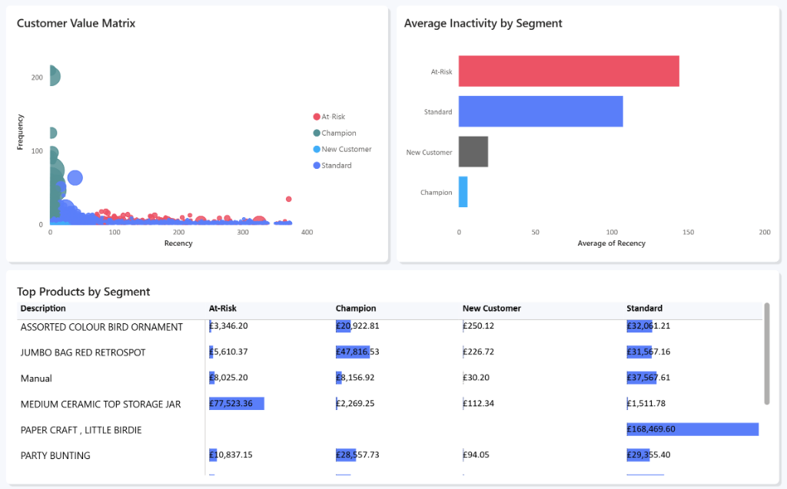

# Ecommerce Analytics

[](https://github.com/timothykimutai/Ecommerce-Analysis/actions)
[](https://www.python.org/downloads/)
[](https://opensource.org/licenses/MIT)

RFM analysis and customer segmentation system for ecommerce data with automated root-cause analysis and actionable business insights.

## 📊 Overview

This project performs comprehensive customer analytics on ecommerce transaction data using RFM (Recency, Frequency, Monetary) modeling to:
- Segment customers into actionable groups (Champion, At-Risk, New Customer, Standard)
- Identify root causes of customer churn through basket analysis
- Analyze return patterns to uncover quality issues
- Generate executive-ready strategic recommendations

### Key Findings

From the analysis of 4,338 customers:
- **334 At-Risk customers** identified with high churn potential
- **548 Champions** representing the high-value segment
- **17.89% vs 2.07%** item return rate gap (At-Risk vs Champions) - indicating quality/fulfillment issues
- **£616,000** projected revenue impact from recommended interventions

### 📊 Dashboard Visuals

#### Page 1: Executive Pulse


#### Page 2: Customer Behavioral DNA


## ✨ Features

- **Automated ETL Pipeline**: Schema-validated data cleaning with Pandera
- **RFM Segmentation**: Quintile-based customer scoring (1-5 scale)
- **Root-Cause Analysis**: Product basket comparison between segments
- **Return Rate Analysis**: Multi-level return metrics (order & item level)
- **Executive Reporting**: Data-driven strategic recommendations
- **Production-Ready**: CI/CD, Docker support, comprehensive testing

## 🚀 Quick Start

### Prerequisites

- Python 3.9+
- pip or Docker

### Installation

```bash
# Clone the repository
git clone https://github.com/timothykimutai/Ecommerce-Analysis.git
cd Ecommerce-Analysis

# Install dependencies
pip install -r requirements.txt

# Or install in development mode
pip install -e ".[dev]"
```

### Usage

```bash
# 1. Run data cleaning pipeline
python clean_data.py

# 2. Run RFM analysis
python analysis.py

# Or use Make commands
make run-etl
make run-analysis
```

### Docker Deployment

```bash
# Build image
docker build -t ecommerce-analytics .

# Run analysis
docker run -v $(pwd)/output:/app/output ecommerce-analytics

# Or use docker-compose
docker-compose up etl
docker-compose up analytics
```

## 📁 Project Structure

```
Ecommerce-Analysis/
├── analysis.py                 # RFM analysis & segmentation
├── clean_data.py               # ETL pipeline with validation
├── tests/                      # Unit tests (pytest)
│   ├── test_analysis.py
│   └── test_clean_data.py
├── output/                     # Generated data files
│   ├── online_retail_cleaned.parquet
│   ├── online_retail_returns.parquet
│   └── rfm_table.parquet
├── report/                     # Executive deliverables
│   └── executive_summary.md
├── .github/workflows/          # CI/CD pipeline
│   └── ci.yml
├── Dockerfile                  # Container configuration
├── docker-compose.yml          # Multi-service orchestration
├── pyproject.toml              # Project metadata & config
├── requirements.txt            # Python dependencies
├── Makefile                    # Development commands
└── README.md
```

## 🧪 Testing

```bash
# Run all tests
pytest

# Run with verbose output
pytest -v

# Run with coverage
pytest --cov=. --cov-report=html

# Or use Make
make test
```

**Test Coverage:**
- RFM calculation logic
- Customer segmentation rules
- Data cleaning & validation
- Revenue calculations

## 🛠️ Development

```bash
# Install development dependencies
pip install -e ".[dev]"

# Format code with black
make format

# Lint with ruff
make lint

# Type check with mypy
mypy . --ignore-missing-imports

# Clean generated files
make clean
```

## 🔄 CI/CD Pipeline

GitHub Actions workflow automatically runs on every push:

✅ **Code Quality**
- Linting (ruff)
- Type checking (mypy)
- Code formatting validation

✅ **Testing**
- Unit tests (pytest)
- Multi-version Python testing (3.9, 3.10, 3.11)
- Coverage reporting

✅ **Build Validation**
- Docker image build
- Dependency resolution

## 📈 Analysis Methodology

### 1. Data Cleaning
- Remove invalid transactions (missing CustomerID)
- Separate returns (invoice prefix "C")
- Calculate total revenue per transaction
- Schema validation with Pandera

### 2. RFM Scoring
- **Recency**: Days since last purchase (lower = better, score 5)
- **Frequency**: Number of unique orders (higher = better, score 5)
- **Monetary**: Total revenue (higher = better, score 5)

### 3. Customer Segmentation
- **Champion**: R≥5, F≥4, M≥4 (high value, recent, frequent)
- **At-Risk**: R≤2, M≥4 (high value but inactive)
- **New Customer**: R≥4, Frequency=1 (recent first purchase)
- **Standard**: All others

### 4. Root-Cause Analysis
- Basket comparison (product preferences)
- Return rate analysis (quality indicators)
- Segment-specific insights

## 📊 Output Files

| File | Description |
|------|-------------|
| `output/online_retail_cleaned.parquet` | Cleaned sales transactions |
| `output/online_retail_returns.parquet` | Return transactions |
| `output/rfm_table.parquet` | Customer RFM scores & segments |
| `report/executive_summary.md` | Strategic recommendations |

## 🎯 Business Impact

### Recommended Interventions

1. **At-Risk Win-Back Campaign**
   - Target: 334 customers
   - Projected recovery: £413,000

2. **Champion VIP Program**
   - Target: 548 customers
   - Projected retention: £213,000

3. **Quality Improvement Initiative**
   - Address 17.89% item return rate
   - Focus on At-Risk segment products

**Total Projected Impact**: £616,000 in recovered/retained revenue

## 🤝 Contributing

Contributions are welcome! Please:
1. Fork the repository
2. Create a feature branch (`git checkout -b feature/amazing-feature`)
3. Commit your changes (`git commit -m 'Add amazing feature'`)
4. Push to the branch (`git push origin feature/amazing-feature`)
5. Open a Pull Request

## 📝 License

This project is licensed under the MIT License - see the [LICENSE](LICENSE) file for details.

## 👤 Author

**Timothy Kimutai**
- GitHub: [@timothykimutai](https://github.com/timothykimutai)

## 🙏 Acknowledgments

- Dataset: [UCI Machine Learning Repository - Online Retail Dataset](https://archive.ics.uci.edu/ml/datasets/online+retail)
- RFM methodology based on industry best practices
- Built with Python, Pandas, Pandera, and Docker
